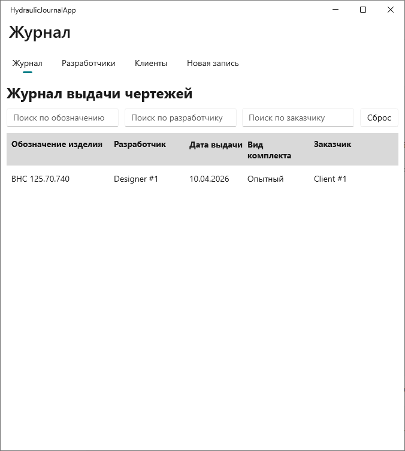

# 💿 Hydraulic Journal App

A lightweight desktop application for managing the issuance of engineering drawings.

Built with .NET MAUI and SQLite for internal use in manufacturing environments.

## 👥 Multi-user Usage

- The application is designed for use from a **shared network folder**
- All users access the same SQLite database
- Requires read/write permissions to the folder

## 🧩 Purpose

This tool solves a critical problem in engineering workflows:

Preventing duplicate product designations across different customers.

## 📌 Notes

- No authentication system (by design for simplicity)
- Suitable for small teams (2–5 users)
